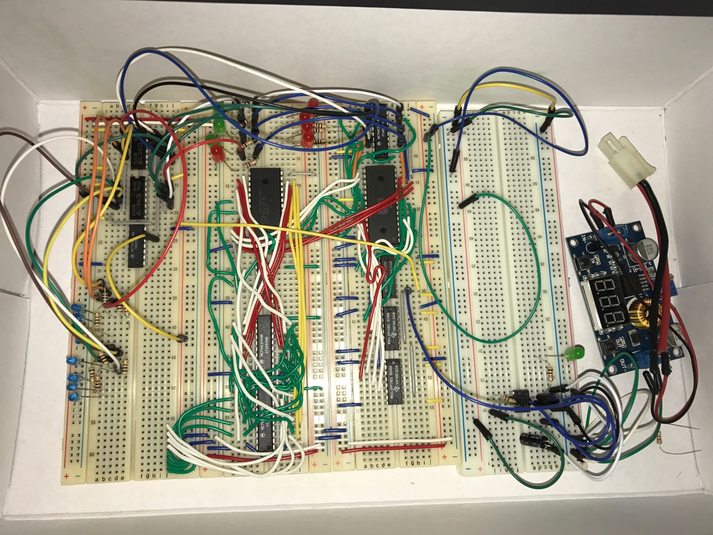

# Gater8
An 8-bit homemade CPU using 7400-series logic chips. It can run program! Or LogicWorks can simulate the execution of program.

.PNG)

The Gater8 CPU was designed for undergraduate students who were taking CS 201 / CS 301 course at the time I was teaching these courses in the University of Regina as sessional lecturer back in 2016. The purpose of this project is to help students understand the principles of computer organization. The CPU together with the computer based on it (with RAM, ROM, and I/O interfaces) were designed by 7400 series gate chips.

Gater8 has 12-bit address bus, 8-bit data bus, and 11 instructions. It has a semi-harvard and semi-von neumann architecture. The design was completed and tested in [LogicWorks 5](https://www.designworkssolutions.com/logicworks-5-windows/). It has been assembling by real 7400 chips. 

## Source Files
There are two variants of Gater8 design, they are pretty much the same expect one has a [MOV instruction](./CPU(2016_04_02_MOV_Ver).PNG), and the other has an [OR instruction](./CPU(2016_04_03_OR_Ver).PNG). The *.cct files are corresponding source file designed in LogicWorks 5.

## The Logic Design Diagram

- The logic diagram is [Logic Diagram](./logic_diagram.pdf).
- The control log details are in [this table](./chips.pdf)
- A schametics design (OR instruction version) is shown above:
- Assembling is in progress, the partly done picture is shown below:

## Some Technical Specifications
Here is a summary and detailed breakdown of the design:

Gater8 is an 8-bit computer system designed and tested using LogicWorks 5. Although it is 8-bit, the principles are identical to 32-bit systems.

### Hardware Specifications:

  - Data Bus: 8-bit

  - Address Bus: 12-bit

  - Controller: Hardwired logic

  - Speed: Estimated 1MHz+ (up to 5MHz theoretically)

  - Instruction Set: 11 instructions

  - Memory Architecture: Hybrid Harvard/Von Neumann

  - RAM/ROM: 4KB each

  - I/O: One 8-bit input, two 8-bit outputs

### Registers

To minimize the chip count for physical assembly, only a limited set of registers is applied in the design:

  - A & T: 8-bit operational registers (using 74x825 chips).

  - PC (Program Counter): 12-bit (using three 74x161 4-bit counters).

  - IR (Instruction Register): 8-bit.

  - DEV1 & DEV2: 8-bit output registers.

Note: The author removed the Memory Address (MA) and B registers from the original plan to simplify the circuit, meaning indirect addressing and a hardware stack are not supported.

### The Bus System

  * Data Bus: Connects all registers, ALU, RAM/ROM, and I/O. Since it's a shared bus, only one component can output at a time, controlled by 74x244 tri-state buffers.

  * Address Bus: 12 bits wide. The lower 8 bits are shared with the data bus to allow ROM to output address data, while the upper 4 bits come from the IR register.

### RAM and ROM (Memory)

The design uses a "Semi-Harvard" architecture:

  * Harvard aspect: RAM and ROM have independent content spaces (even if they share the same address).

  * Von Neumann aspect: RAM and ROM share the same data bus, so they cannot be accessed simultaneously.

Details:

  - ROM: Uses an AT28C64 chip. It includes the PC (Program Counter) which automatically increments or can be loaded with a new address for jumps (JMP/JNZ).

  - RAM: Uses a CY62256 SRAM chip. It is fast (70ns) and does not require the complex refresh circuitry of DRAM.

### Control and Timing

The CPU operates on positive edge clock signals. Every operation (micro-instruction) takes one clock cycle. A full instruction typically takes 3 to 4 clock cycles. The speed is limited by the longest "data path," which in this case is ROM access (approx. 100ns–200ns total).

Below are Some Key Concepts Used in Design:

  - D Flip-Flops: The building blocks of registers.

  - Karnaugh Maps (K-maps): Used to simplify Boolean expressions for the control logic.

  - 8-bit Parallel Adders: The core of the ALU (Arithmetic Logic Unit).

  - Sequential Circuits: Using flip-flops and logic to create state machines and counters.
